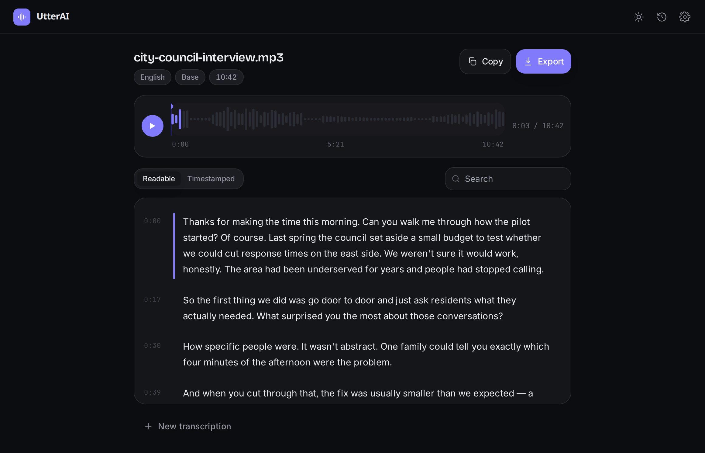
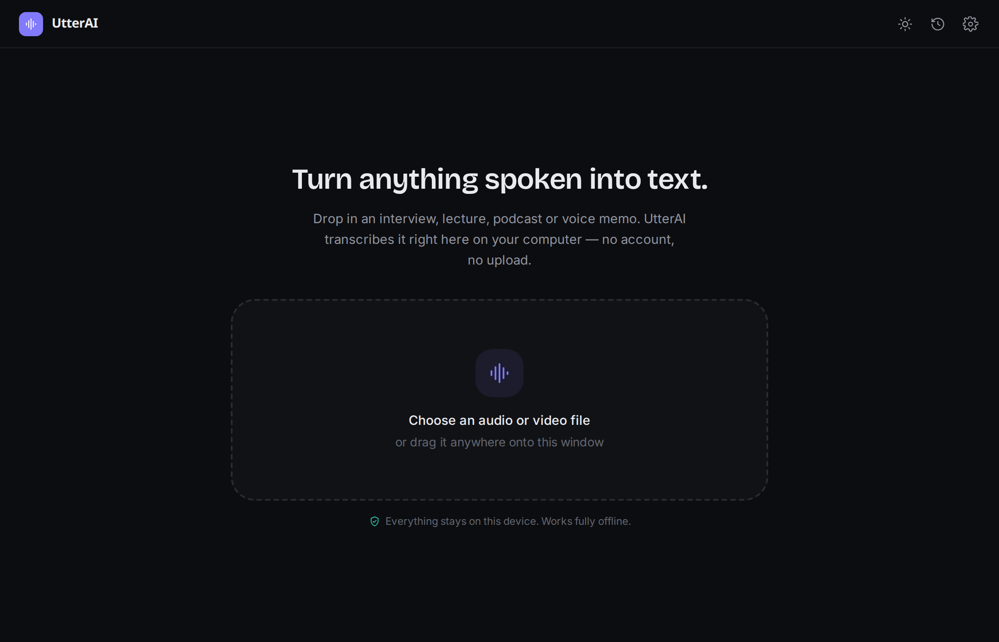
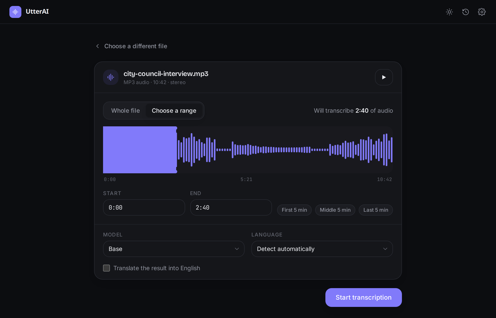
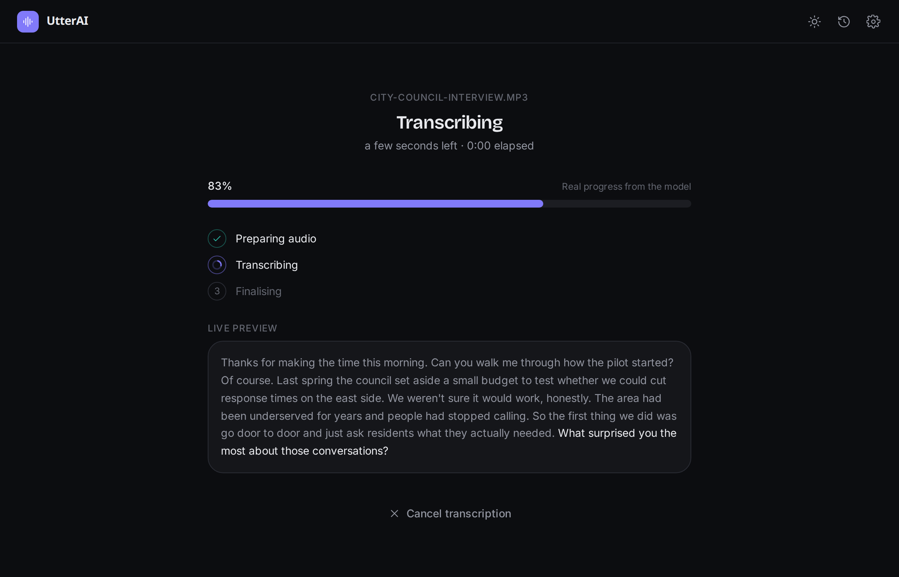
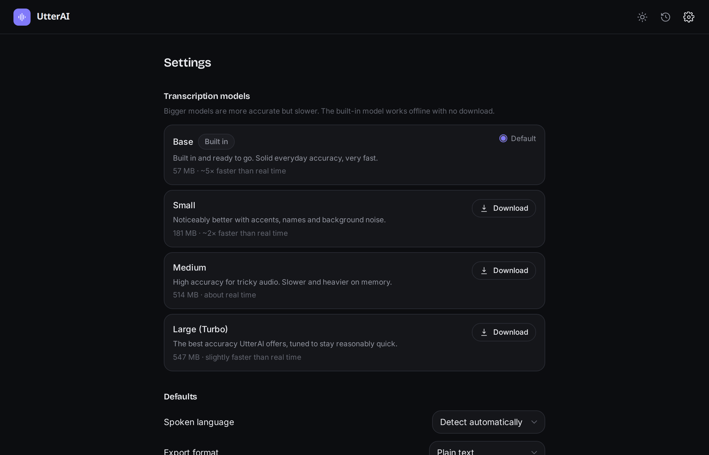

<div align="center">


# UtterAI

**Private, local audio &amp; video transcription.**

Pick a file → choose what to transcribe → watch real progress → get a clean transcript → export it.<br />
No account. No upload. No API key. Works offline.

[](https://github.com/thisisankit27/utter-ai/actions/workflows/ci.yml)
[](https://github.com/thisisankit27/utter-ai/releases/latest)
[](https://github.com/thisisankit27/utter-ai/releases)
[](LICENSE)
[](#platforms)

[**Download**](https://utter-ai.vibethroughcode.com) &nbsp;·&nbsp; [Website](https://utter-ai.vibethroughcode.com) &nbsp;·&nbsp; [Changelog](CHANGELOG.md) &nbsp;·&nbsp; [Report a bug](https://github.com/thisisankit27/utter-ai/issues/new/choose)



</div>

---

## What it does

UtterAI turns anything you can hear into text, entirely on your own computer.
It's for people who transcribe interviews, lectures, podcasts, meetings and
voice memos and would rather their recordings never left the machine.

- **Local by design.** Transcription runs offline via
  [whisper.cpp](https://github.com/ggerganov/whisper.cpp). UtterAI only touches
  the network when you download a model or when it checks for an update — and the
  update check can be turned off.
- **Transcribe part or all.** Drag the range handles or type exact in/out points
  — only the audio you selected is processed.
- **Honest progress.** A real percentage from the model, a live preview of the
  text as it arrives, and a clear stage for every step. Never a frozen window.
- **A real transcript.** Readable paragraphs and a timestamped view,
  click-to-play sync, in-transcript search, inline editing.
- **Sensible exports.** TXT, timestamped TXT, SRT, VTT, Markdown, JSON.
- **Built-in model.** A compact model ships inside the installer, so the first
  transcription works with zero setup. Download Small / Medium / Large (Turbo)
  anytime for more accuracy.
- **Updates itself.** Opt-in-by-default, signature-verified in-app updates — no
  reinstall. Switch it off in Settings and it never phones home.

## Download

Grab the installer for your platform from the
[**latest release**](https://github.com/thisisankit27/utter-ai/releases/latest),
or from [utter-ai.vibethroughcode.com](https://utter-ai.vibethroughcode.com)
which detects your OS.

| Platform | File |
| --- | --- |
| Windows 10/11 | `UtterAI_x.y.z_x64-setup.exe` (recommended) or `_x64_en-US.msi` |
| Ubuntu / Debian | `UtterAI_x.y.z_amd64.deb` |
| Other Linux | `UtterAI_x.y.z_amd64.AppImage` |

Installers aren't signed by an OS-recognised authority, so you'll see a
SmartScreen / "unverified" prompt on first launch. Every artifact has a
published SHA-256 in `checksums.txt` on the release.

## Screenshots

|  |  |
| --- | --- |
|  |  |
| **Drop in a file** — audio or video, any common format. | **Choose a range** — or the whole thing; you always see how much will be transcribed. |
|  |  |
| **Real progress** — percentage, stage, and a live text preview. | **Models &amp; settings** — download bigger models, tune defaults, manage updates. |

## Platforms

| Platform | Artifact | Status |
| --- | --- | --- |
| Windows 10/11 | `.exe` (NSIS) / `.msi` | Supported |
| Ubuntu / Linux | `.AppImage` / `.deb` | Supported |
| macOS | — | Not built yet — the engine is portable Rust, so it's feasible |
| Android | — | Planned; core is a portable crate ready for a mobile shell |

## How it works

```
probe  →  extract the selected range to 16 kHz mono WAV  →  load model
      →  whisper.cpp (streaming progress + partial segments)
      →  re-chunk into paragraphs + caption-sized segments  →  export
```

Temporary audio is written `0600` into an app-owned cache and deleted on
completion, on cancel, and on the next launch. The core transcription path makes
zero network calls — there's a test that enforces it.

## Project structure

| Path | What it is |
| --- | --- |
| [`crates/utterai-core`](crates/utterai-core) | The portable Rust engine — ffprobe/ffmpeg, model management, whisper.cpp inference, chunking, exporters. No UI, no Tauri. |
| [`src-tauri`](src-tauri) | Tauri v2 desktop shell — commands, events, bundled sidecars, the updater. Thin. |
| [`src`](src) | React + TypeScript + Tailwind front end. Runs in a browser against a mock backend. |
| [`site`](site) | Static landing page → GitHub Pages. |
| [`scripts`](scripts) | Build container, sidecar fetch, icon + fixture generation. |
| [`tests`](tests) | Playwright (mock app + site) and a WebdriverIO + tauri-driver walkthrough of the packaged binary. |

## Building from source

You need **Rust** (stable), **Node 22+**, and the native libraries Tauri and
whisper.cpp need (`cmake`, `clang`/`libclang`, GTK/WebKit `-dev` packages on
Linux). The exact list is in
[`scripts/Dockerfile.build`](scripts/Dockerfile.build).

```bash
git clone https://github.com/thisisankit27/utter-ai
cd utter-ai
npm install
scripts/fetch-binaries.sh          # ffmpeg/ffprobe sidecars for your platform
curl -fL -o src-tauri/resources/models/ggml-base-q5_1.bin \
  https://huggingface.co/ggerganov/whisper.cpp/resolve/main/ggml-base-q5_1.bin

npm run tauri dev                  # run
npm run tauri build                # package
```

Or use the container for a reproducible Linux build:

```bash
docker build -f scripts/Dockerfile.build -t utterai-build .
scripts/inbox.sh bash -lc 'npm ci && npm run tauri build'
```

See [CONTRIBUTING.md](CONTRIBUTING.md) for the full workflow.

## Testing

```bash
cargo test --workspace                                            # engine, exporters, chunking
scripts/make-fixtures.sh                                          # generate media fixtures
UTTERAI_TEST_MODEL=/path/to/ggml-tiny.bin cargo test --workspace  # + the real pipeline
npx playwright test                                               # mock app + landing page
npm run test:e2e                                                  # packaged-app walkthrough (tauri-driver)
```

## Privacy

UtterAI makes three kinds of network request, all optional and none involving
your media: downloading a model, checking for an update (switchable off), and —
on the website only — reading the public download count. It logs no media,
filenames or transcript text at the default level.
Full detail: [docs/PRIVACY.md](docs/PRIVACY.md) ·
Security review: [docs/SECURITY.md](docs/SECURITY.md) ·
Report a vulnerability: [SECURITY.md](SECURITY.md).

## Contributing

Issues and pull requests are welcome — see [CONTRIBUTING.md](CONTRIBUTING.md) and
the [Code of Conduct](CODE_OF_CONDUCT.md). UtterAI is deliberately small; changes
that keep it focused land fastest.

## Acknowledgements

Built on [whisper.cpp](https://github.com/ggerganov/whisper.cpp),
[whisper-rs](https://github.com/tazz4843/whisper-rs), [Tauri](https://tauri.app),
[FFmpeg](https://ffmpeg.org), and OpenAI's
[Whisper](https://github.com/openai/whisper) models.

## License

[MIT](LICENSE) © Ankit Srivastava
